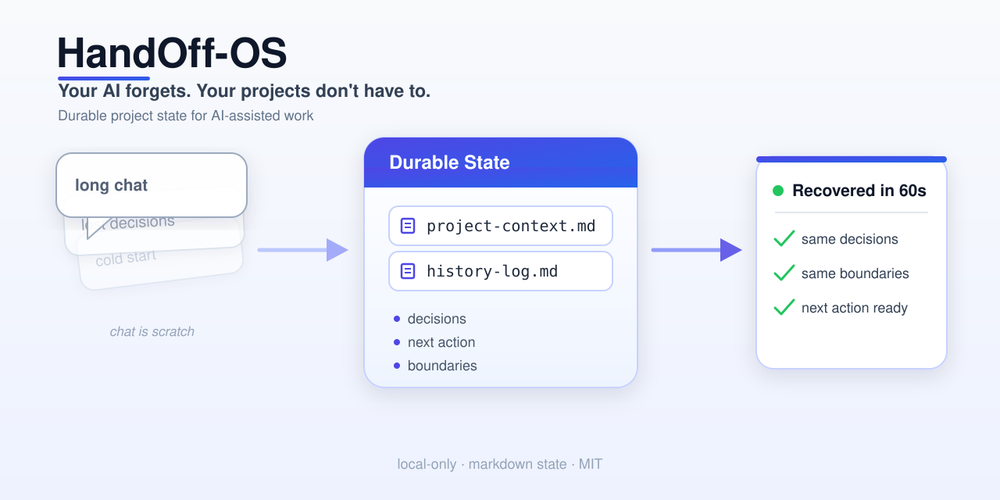

# HandOff-OS

Your AI forgets. Your projects don't have to.

HandOff-OS is a lightweight project-memory and handoff layer for ChatGPT, Claude, Cursor, Codex, and other AI tools.

Long AI projects fail when the project state only lives inside a chat. The chat gets too long, the next model starts cold, and yesterday's decisions turn into a bad summary.

HandOff-OS keeps the durable state in small Markdown files so a fresh chat can resume without guessing, rereading transcripts, or mixing projects.

**Try it first:** [AI project rescue demo](demo/ai-project-rescue/) — see a fresh chat recover a lost project from two Markdown files.

---

## Who this is for

HandOff-OS is for people running long AI-assisted work across more than one tool:

- builders using ChatGPT plus Claude Code, Cursor, Codex, or another coding agent
- solo founders and operators who manage several projects at once
- researchers and technical PMs who need decisions, source pointers, and boundaries to survive new chats
- consultants, legal-style operators, and high-consequence workflows where "the AI probably remembers" is not good enough
- small teams that need an AI handoff pattern before they need a full project-management platform

It is not necessary for one-off questions, short prompts, or disposable experiments.

---

## See the rescue in 30 seconds

The core demo is simple:

```text
old chat is gone
        ↓
project-context.md + history-log.md survive
        ↓
fresh chat recovers the project state
        ↓
work continues without rebuilding context
```

The demo shows a fictional AI-assisted software project where the original chat is lost. A new chat recovers from two small files — `project-context.md` and `history-log.md` — instead of a transcript.

What the fresh chat gets back:

- current state
- settled decisions
- next action
- active boundaries
- source pointers

No chat log. No private payload. No guessing.



---

## 2-minute setup

Requires Python 3.9+.

From the repository root:

```bash
pip install -e .
handoffos init my-project
handoffos status my-project
```

This creates a local HandOff-OS workspace:

```text
my-project/
├── project-context.md   # living briefing
├── history-log.md       # what changed and when
├── proposal.md          # decision/action request
└── review.md            # review verdict
```

No network calls. No accounts. No service integrations.

---

## Zero-install option

You do not need the CLI.

Copy the files from [`templates/`](templates/) into any project folder and start filling them in:

```text
project-context.md
history-log.md
proposal.md
review.md
```

Then start a new AI chat with a prompt like this:

```text
You are resuming this project from HandOff-OS durable state.

Treat the chat as scratch, not as the source of truth.
Use the project context and history below as the canonical briefing.
Do not invent missing facts.
If a decision, next action, boundary, or source pointer changes, tell me what should be checkpointed.

[Paste project-context.md]

[Paste history-log.md]
```

The CLI only makes setup safer and repeatable. The protocol works with plain Markdown.

---

## Why not just create a folder yourself?

You can. HandOff-OS is intentionally simple.

The value is not that it creates files. The value is the state contract:

- what to save
- what not to save
- where decisions live
- when a checkpoint is worth writing
- how one AI hands work to another
- which actions need human approval
- how a fresh chat resumes without guessing

A random folder gives you storage. HandOff-OS gives you a lightweight operating pattern for keeping AI-assisted work recoverable.

The CLI exists to make that pattern quick to start, hard to accidentally overwrite, and consistent across projects.

---

## The core rule

> Chat is scratch. Durable state lives outside the chat.

You do the real thinking in ChatGPT, Claude, Cursor, or another AI tool. Before the chat becomes stale or disappears, checkpoint only the facts future-you needs.

Save only what would make future work wrong, blocked, or duplicated if lost.

A fresh AI chat should be able to answer four questions from durable state:

1. What is true now?
2. What decision or task is next?
3. What must not be touched?
4. Where is the real source material?

---

## What HandOff-OS stores

HandOff-OS keeps four small files:

| File | Purpose |
|---|---|
| `project-context.md` | The current briefing: status, purpose, decisions, next action, boundaries, source pointers |
| `history-log.md` | A compact record of what changed and what it superseded |
| `proposal.md` | A scoped request for a decision or action |
| `review.md` | A reviewer verdict: PASS, REVISE, BLOCKED, or OUT_OF_SCOPE |

That is the memory layer.

The source material stays where it belongs: GitHub, Notion, Drive, local files, tickets, or another system of record.

HandOff-OS stores pointers, not payloads.

---

## The role split

HandOff-OS assumes a simple division of labor that works across AI tools:

| Role | Who | Does |
|---|---|---|
| Scope & review | ChatGPT or another reasoning model | Frames the task, defines boundaries, reviews the result |
| Draft & build | Claude, Cursor, Codex, or another building tool | Produces the draft, code, or artifact within scope |
| Approve | Human owner | Approves execution, publication, or high-consequence changes |

One AI may draft and another may review, but there are no automatic AI-checks-AI loops.

The human owner is the only approver.

---

## What to save — and what not to

Save:

- decisions that are now load-bearing
- the next action
- source pointers
- active boundaries
- unresolved high-consequence items
- facts that would block, distort, or duplicate future work if lost

Do not save:

- full transcripts
- thinking-out-loud
- stale debate
- private payloads that belong in another system
- anything easy to re-derive

If losing it would not make future work wrong, blocked, or duplicated, it is scratch.

---

## Public-safety boundary

This repository is a public, clean-room edition. Everything in it is abstract guidance, reusable templates, and fictional examples.

When you use HandOff-OS for real work, keep private material out of any file you might share.

Do not put into shared HandOff-OS files:

- exported private documents
- real legal facts, case numbers, or party names
- real lab, sample, server, dataset, or customer identifiers
- financial, tax, banking, or credit material
- private emails or communications
- credentials, tokens, or private links

Use source pointers instead.

Bad:

```text
Customer database password: ...
Full private email thread: ...
Court filing facts copied here: ...
```

Better:

```text
Source pointer: internal ticket ABC-123
Source pointer: local file path known to the owner
```

---

## Using the CLI

```bash
# create a new workspace
handoffos init my-project

# regenerate the four HandOff-OS files in an existing workspace
handoffos init my-project --force

# print a compact status summary from project-context.md
handoffos status my-project
```

What `--force` does:

- overwrites only the four HandOff-OS files:
  - `project-context.md`
  - `history-log.md`
  - `proposal.md`
  - `review.md`

What `--force` does not do:

- it does not delete unrelated files
- it does not modify your notes, attachments, or subfolders
- it does not call any network service

Without `--force`, `init` refuses to run if any of the four files already exist.

---

## Local-only, no network

The v0.1 CLI is local-only.

It uses only the Python standard library, makes no network calls, and connects to no external service. It reads bundled templates and writes Markdown files on your machine.

The technical package and command name are lowercase:

```text
handoffos
```

The public display name is:

```text
HandOff-OS
```

---

## What this is not

- Not a full project-management system. It is a memory layer, not a tracker.
- Not a prompt collection. The templates support a workflow; they are not the product by themselves.
- Not a transcript archive. It stores decisions and state, not chat logs.
- Not an autonomous approval system. A human always approves.
- Not a replacement for Notion, GitHub, Drive, Linear, Jira, or local files. It points to them.
- Not necessary for one-off questions or short chats.

---

## Repository layout

```text
HandOff-OS/
├── README.md
├── LICENSE
├── CONTRIBUTING.md
├── SECURITY.md
├── pyproject.toml
├── docs/          # philosophy, risk tiers, workflows, checklist, assets/
├── templates/     # copyable Markdown templates
├── examples/      # synthetic software / research / redacted-legal demos
├── demo/          # walkthrough: recover a lost chat from durable state
├── handoffos/     # Python package: CLI + packaged templates
└── tests/         # standard-library test suite
```

Two folders that are easy to confuse:

- `demo/` is a guided walkthrough.
- `examples/` are reusable synthetic project states.

Two names that are intentionally different:

- `HandOff-OS` is the product and repository display name.
- `handoffos` is the Python package and CLI command.

---

## Learn more

- [AI project rescue demo](demo/ai-project-rescue/) — recover a lost chat from durable state
- [Launch page copy](docs/launch.md) — the short external-facing explanation
- [Philosophy](docs/philosophy.md) — chat is scratch, state is durable
- [Risk tiers](docs/risk-tiers.md) — when an action needs review
- [Dual-AI workflow](docs/dual-ai-workflow.md) — scope, build, review, approve
- [Notion setup](docs/notion-setup.md) — a manual, no-API home for state
- [GitHub workflow](docs/github-workflow.md) — proposal → branch → review → merge
- [Publication review checklist](docs/publication-review-checklist.md) — run before going public
- [Examples](examples/) — software, research, and a redacted legal workflow

---

## Need help setting this up?

HandOff-OS is free, local-first, and designed to work without an account or hosted service.

If you run long AI-assisted projects and keep losing context across ChatGPT, Claude Code, Cursor, Codex, or other tools, the likely issue is not prompting. It is missing project memory, source-of-truth boundaries, and approval gates.

Possible setup help:

- project memory structure
- ChatGPT / Claude / Cursor / Codex handoff prompts
- GitHub, Notion, Drive, or local-file source-of-truth map
- review and approval gates for high-consequence work
- checkpoint rules so future chats resume without guessing

Open a GitHub issue or discussion to share your workflow and what broke. Paid implementation, workflow audit, or template support can be added later if there is demand.

---

## Development

Run the test suite with the standard library:

```bash
python -m unittest discover -s tests -t .
```

Or with pytest, via the optional dev extra:

```bash
pip install -e ".[dev]"
python -m pytest
```

## License

MIT. See [LICENSE](LICENSE).
