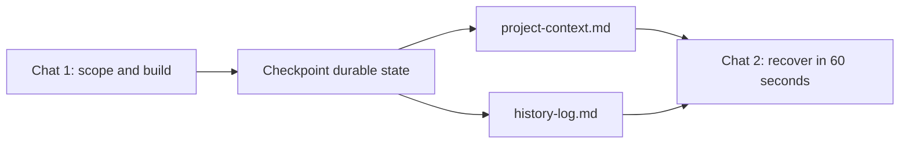

# HandoffOS

Your AI forgets. Your projects don't have to.

Every serious AI project eventually dies in a chat history.
The chat gets too long, a new model starts cold, and yesterday's decisions turn into a bad summary.

HandoffOS keeps the few facts that matter alive outside the chat.

HandoffOS gives you:

- a living `project-context.md`
- a durable `history-log.md`
- proposal/review templates for high-consequence actions
- a tiny local CLI: `init` and `status`
- a demo showing how to recover a lost AI project in a fresh chat

---

## Quick start

Requires Python 3.9+. Clone the repo, then run from the repository root:

```bash
pip install -e .
handoffos init my-project
handoffos status my-project
```

This creates a local HandoffOS workspace. No network calls. No accounts. No
integrations.

## How it works



You do the real thinking in a chat. Before you close it, you checkpoint the few
durable facts into two small files. A new chat — any model — recovers the
project from those files instead of a transcript.

## Try the 2-minute rescue demo

Start here: [AI project rescue demo](demo/ai-project-rescue/)

The demo shows a fictional project where the original chat is lost, but a new
chat recovers from `project-context.md` and `history-log.md`.

## Why not just use chat memory?

Chat memory is useful, but it is not a project source of truth.

HandoffOS keeps project state:

- explicit
- editable
- reviewable
- tool-agnostic
- shareable with any model or teammate

The goal is not to remember everything. The goal is to save only what would make
future work wrong, blocked, or duplicated if lost.

## Who this is for

HandoffOS is for people running multi-day AI-assisted projects:

- Claude Code / Cursor / ChatGPT power users
- solo builders
- technical PMs
- researchers and operators with long-running workflows
- anyone who keeps restarting from bad summaries

It is probably overkill for one-off questions or simple chats.

---

## The solution

Keep the durable state of a project **outside any single chat**.

> **Chat is scratch. Durable state lives outside the chat.**

HandoffOS is a small set of documents (and an optional CLI that creates them)
that hold the few things future-you actually needs:

- the **decisions** that have been made,
- the **next action**,
- **pointers** to where the real source material lives,
- the **boundaries** that are currently in force.

That's it. No transcript hoarding. No external automation, no autonomous
execution, no service integrations. No lock-in.

## The role split

HandoffOS assumes a simple division of labor that works across tools:

| Role | Who | Does |
|---|---|---|
| **Scope & review** | ChatGPT (or any "thinking" model) | Frames the task, defines boundaries, reviews the result |
| **Draft & build** | Claude (or any "building" model) | Produces the draft, code, or artifact within that scope |
| **Approve** | The human owner | Approves execution or publication — always |

One AI may draft and another may review, but there are **no automatic
AI-checks-AI loops**. The human owner is the only approver.

---

## 10-minute setup

1. **Install the CLI** (optional but convenient). Run this from the cloned
   repository root:

   ```bash
   pip install -e .
   ```

2. **Create a project workspace:**

   ```bash
   handoffos init my-project
   ```

   This creates four files: `project-context.md`, `history-log.md`,
   `proposal.md`, and `review.md`.

3. **Fill in `project-context.md`.** Status, purpose, current state, next
   action, and active boundaries. Two minutes.

4. **Work in your AI tools as usual.** When something durable happens — a
   decision, a new boundary, a finished artifact — write it down.

5. **Before you close a chat,** update `project-context.md` and add a line to
   `history-log.md`. That's the handoff.

Next time you (or a fresh chat, or a different model) pick the project up, the
context file is the briefing.

---

## What to save — and what not to

**Save only what would make future work wrong, blocked, or duplicated if lost.**

Save:

- **Decisions** that are now load-bearing.
- **Next actions** — the single most useful one.
- **Source pointers** — where the real material lives (a file path, a doc title, a ticket).
- **Active boundaries** — what's in and out of scope right now.

Do **not** save:

- Transcripts or full chat logs.
- Thinking-out-loud that didn't change anything.
- Anything you could trivially re-derive.

If losing it wouldn't make future work wrong, blocked, or duplicated, it's scratch.

---

## Public-safety boundary

This repository is a **public, clean-room edition**. Everything in it is
abstract guidance, reusable templates, and **fictional** examples.

When you use HandoffOS for real work, keep private material out of any file you
might share. Do not put into shared HandoffOS files:

- exported private documents,
- real legal facts, case numbers, or party names,
- real lab, sample, server, dataset, or customer identifiers,
- financial, tax, banking, or credit material,
- private emails or communications,
- credentials, tokens, or private links.

HandoffOS stores **pointers**, not payloads. Point to where the sensitive
source lives; don't paste it in.

---

## Using the templates manually (no CLI)

You don't need the CLI. Copy the files from [`templates/`](templates/) into a
folder and start filling them in:

```text
project-context.md   ← the living briefing
history-log.md       ← what changed and when
proposal.md          ← for a specific decision or action
review.md            ← the reviewer's verdict
```

The [`templates/operating-rules-lite.md`](templates/operating-rules-lite.md)
file is a short, copyable rule sheet you can paste into a project or a system
prompt.

## Using the CLI

```bash
# create a new workspace
handoffos init my-project

# regenerate the four HandoffOS files in an existing workspace
handoffos init my-project --force

# print a compact status summary from project-context.md
handoffos status my-project
```

**What `--force` does:** it overwrites the four HandoffOS files
(`project-context.md`, `history-log.md`, `proposal.md`, `review.md`) if they
already exist.

**What `--force` does *not* do:** it never deletes or modifies any other file in
the directory. Your own notes, attachments, and subfolders are left untouched.
Without `--force`, `init` refuses to run if any of the four files already exist,
so you can't clobber them by accident.

### Local-only, no network

The v0.1 CLI is **local-only**. It uses only the Python standard library, makes
**no network calls**, and connects to **no external service**. It reads bundled
templates and writes Markdown files on your machine — nothing else.

---

## What this is *not*

- **Not** a full project-management system. It's a memory layer, not a tracker.
- **Not** a transcript archive. It stores decisions, not chat logs.
- **Not** an autonomous approval system. A human always approves.
- **Not** a replacement for Notion, GitHub, or Drive. It points *to* them.

---

## Repository layout

```text
handoffos/
├── README.md
├── LICENSE
├── CONTRIBUTING.md
├── SECURITY.md
├── pyproject.toml
├── docs/          # philosophy, risk tiers, workflows, setup, checklist
├── templates/     # copyable Markdown templates
├── examples/      # synthetic software / research / redacted-legal demos
├── demo/          # walkthrough: recover a lost chat from durable state
├── handoffos/     # the Python package (CLI + packaged templates)
└── tests/         # standard-library test suite
```

Two folders that are easy to confuse:

- `demo/` is a guided walkthrough.
- `examples/` are reusable synthetic project states.

## Learn more

- [Philosophy](docs/philosophy.md) — chat is scratch, state is durable
- [Risk tiers](docs/risk-tiers.md) — when an action needs review
- [Dual-AI workflow](docs/dual-ai-workflow.md) — scope, build, review, approve
- [Notion setup](docs/notion-setup.md) — a manual, no-API home for state
- [GitHub workflow](docs/github-workflow.md) — proposal → branch → review → merge
- [Publication review checklist](docs/publication-review-checklist.md) — run before going public
- [AI project rescue demo](demo/ai-project-rescue/) — recover a lost chat from durable state
- [Examples](examples/) — software, research, and a redacted legal workflow

## Development

Run the test suite with the standard library (no extra installs, no network):

```bash
python -m unittest discover -s tests -t .
```

Or with pytest, via the optional dev extra:

```bash
pip install -e ".[dev]"
python -m pytest
```

## License

MIT. See [LICENSE](LICENSE).
